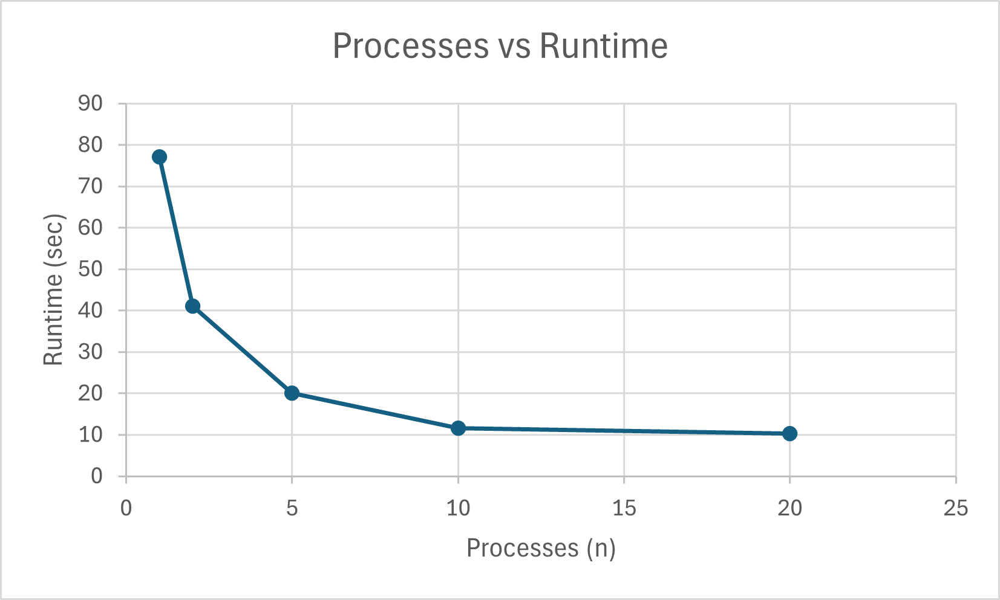

# System Programming Lab 11 Multiprocessing
### Name: Jaffar Mahkamov

---

## Overview

This lab explores unix multiprocessing with the generation of Mandelbrot fractal images using fork(), execlp(), waitpid(), and runtime performance measurement  

Executables produced:

1. **`mandel`** – generates a single Mandelbrot image in JPEG format.  
2. **`mandel_movie`** – launches multiple `mandel` processes in parallel to create a sequence of zoom frames, can enter -p #, to select how many processes to use, -n # to choose the amount of frames to generate

The frames can then be stitched into a video using fmpeg -i
mandel%d.jpg mandel.mpg , allowing us to examine how concurrency affects runtime.




---

## Build Instructions

To compile both programs:

```bash
make

./mandel_movie 

